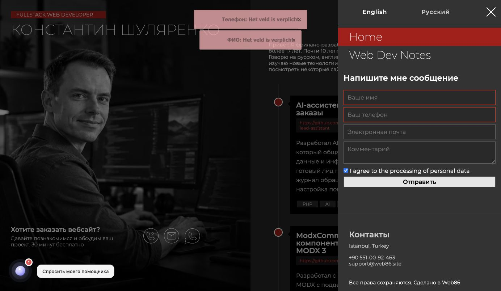

# Диагностика SendIt на web86.site

Дата: 6 октября 2026 года. Проверка выполнена через браузер, MODX Manager и авторизованную консоль Jino.

## ROOT CAUSE

При рендере английской главной страницы скрипт `window.siConfig` терялся из-за конфликта числовых ключей между ранней регистрацией JavaScript плагином MarkdownEditor и восстановлением языкового кэша MODX.

Последовательность подтверждена чтением кэша и трассировкой полного запроса в отдельном CLI-процессе, без изменения production-кода для трассировки:

1. MarkdownEditor на `OnWebPageInit` регистрирует inline-скрипт Embedly. Он занимает `$modx->jscripts[0]`.
2. Английский языковой кэш ресурса 3 содержит `_jscripts[0] = siConfig`, `_jscripts[1] = SendIt index.js`.
3. В `core/model/modx/modrequest.class.php:213` MODX объединяет массивы оператором `+`. При одинаковом числовом ключе остаётся левое значение. Поэтому скрипт Embedly вытесняет конфигурацию SendIt.
4. На строке 215 MODX отдельно восстанавливает `_loadedjscripts` через `array_merge`. В этом реестре конфигурация SendIt остаётся отмеченной как уже загруженная.
5. SendIt на `OnLoadWebDocument` вызывает `loadCssJs()`, но `modX::regClientScript()` на строках 1565–1568 пропускает повторную регистрацию уже отмеченного скрипта.
6. `index.js` обращается к `window['siConfig']['version']` и падает до импорта основного модуля и установки обработчиков submit.
7. У формы нет `method` и `action`. Без обработчика браузер выполняет обычный GET на текущий адрес с полями формы в query string и перезагружает страницу.

На `/ru/` при исходной проверке конфигурация присутствовала и AJAX работал. Сбой был воспроизведён именно на английской главной `/`.

## EVIDENCE

### Браузер до исправления

Ошибка:

```text
TypeError: Cannot read properties of undefined (reading 'version')
at https://web86.site/assets/components/sendit/js/web/index.js?v=1785325206:1:66
```

В HTML присутствовал `<script type="module" src="assets/components/sendit/js/web/index.js?v=1785325206">`, но отсутствовал скрипт присваивания `window.siConfig`. В runtime `window.SendIt` был `undefined`.

При submit английской формы Network зафиксировал запрос типа `Document`, метод GET, к `https://web86.site/?full_name=...&phone=...&email=...&question=...&privacy=on&url=...&message2=...&org=...`, HTTP 200. Запроса Fetch/XHR к SendIt endpoint не было.

Дополнительная ошибка:

```text
ReferenceError: jQuery is not defined
at https://web86.site/assets/js/grand-home.js?v=11:1:13
```

Она возникала также на `/ru/`, где SendIt успешно выполнял AJAX, поэтому не является причиной этого сбоя. Этот отдельный дефект не исправлялся.

### Серверные файлы и кэш

Базовый каталог сайта:

```text
/home/users/s/specchina/domains/web86.site/
```

Значимые места:

- `core/components/markdowneditor/model/markdowneditor/Event/OnWebPageInit.php:34–36` — получение Embedly HTML и вызов `regClientHTMLBlock` до чтения ресурсного кэша.
- `core/components/markdowneditor/model/markdowneditor/oEmbed/Service/EmbedlyCards.php:43–58` — inline-скрипт Embedly.
- `core/model/modx/modrequest.class.php:113` — событие `OnWebPageInit` перед загрузкой ресурса.
- `core/model/modx/modrequest.class.php:213–215` — объединение реальных скриптов и отдельного реестра загруженных скриптов.
- `core/model/modx/modx.class.php:1565–1568` — пропуск повторной регистрации.
- `core/components/sendit/services/sendit.class.php:429–437` — место минимального исправления.

Чтение языковых файлов кэша показало:

```text
core/cache/resource/en/web/resources/3.cache.php:
  _jscripts = [CONFIG, MODULE]
  _loadedjscripts содержит CONFIG

core/cache/resource/ru/web/resources/3.cache.php:
  _jscripts = [CONFIG, MODULE]
  _loadedjscripts содержит CONFIG
```

Нелокализованный кэш `core/cache/resource/web/resources/3.cache.php` имел другой порядок `[Embedly, CONFIG, MODULE]`. Поэтому для диагностики важен именно языковой кэш, реально используемый английским запросом.

Трассировка английского рендера до исправления:

```text
BEFORE OnHandleRequest []
AFTER  OnHandleRequest []
BEFORE OnWebPageInit []
REG OTHER []
AFTER  OnWebPageInit [OTHER]
BEFORE OnLoadWebDocument [OTHER, MODULE]
REG CONFIG [OTHER, MODULE]
REG MODULE [OTHER, MODULE]
AFTER  OnLoadWebDocument [OTHER, MODULE]
```

`REG CONFIG` здесь означает попытку регистрации: штатный метод пропускал её из-за `_loadedjscripts`.

### Форма и настройки

В Manager прочитаны шаблон Main (2) и GrandSidebarChunk (10). Чанк вызывает `!RenderForm` с `tpl=sideForm.tpl`, `presetName=snippet_form2` и hooks `validateJs,email,FormItSaveForm`.

На фронте присутствуют:

```html
<form data-si-form="Inquery"
      data-si-preset="snippet_form2"
      data-si-event="submit"
      class="myforma">
  ...
  <button type="submit" id="fasong">...</button>
</form>
```

`base href` соответствует `https://web86.site/`. Endpoint конфигурации — `/assets/components/sendit/action.php`. Конфигурация JS: `../configs/modules.inc.js`.

Версии по Manager и журналу установленных transport-пакетов: MODX 2.8.8-pl, FormIt 4.2.7-pl, последняя установленная версия SendIt 2.8.6-pl от 24 августа 2026 года. Пакеты не обновлялись.

Журнал Manager содержит изменения Main (2) 1 октября в 14:10:49 и 18:45:09 и изменения GrandFooterScripts (11) 1 октября. Сам журнал не содержит снимков предыдущего кода, поэтому конкретное историческое редактирование, впервые вызвавшее конфликт, не установлено. Технический механизм текущего сбоя подтверждён независимо от этой истории.

### Endpoint и блокировки

В исходной проверке `/ru/` запрос Fetch POST к `https://web86.site/assets/components/sendit/action.php` получил HTTP 200 и корректный JSON валидации с обязательным телефоном. После исправления обе языковые версии получили HTTP 200 и успешный JSON.

Таким образом, установленный сбой происходил до обращения к серверу: CSP/CORS, CSRF, mod_security, nginx/Cloudflare, HTTP/HTTPS и редирект endpoint не объясняют отсутствие AJAX на английской странице. Наличие скрытых правил инфраструктуры отдельно не аудировалось; для установленной причины PHP/nginx/access logs не потребовались.

## FIX

Изменён только файл:

```text
/home/users/s/specchina/domains/web86.site/core/components/sendit/services/sendit.class.php
```

В `loadCssJs()` конфигурация вынесена в `$configScript`. Если она отсутствует в реальном массиве `$modx->jscripts`, снимается устаревшая отметка в `$modx->loadedjscripts`, после чего используется штатный `regClientScript()`:

```php
$configScript = "<script> window.siConfig = $webConfig; </script>";
// A cached registration can survive after another plugin replaces its script slot.
if (!in_array($configScript, $this->modx->jscripts, true)) {
    unset($this->modx->loadedjscripts[$configScript]);
}
$this->modx->regClientScript($configScript, 1);
```

Сначала исправление проверено в памяти отдельного PHP-процесса: конфигурация восстановилась ровно один раз. Затем сделана резервная копия и внесён патч. `php -l` сообщил `No syntax errors detected`.

Резервная копия вне публичного каталога:

```text
/home/users/s/specchina/sendit-diagnostic-backup-20261006-132308/sendit.class.php
```

Настройки MODX, чанки, шаблоны, frontend JS, SMTP и пакеты не менялись. Кэш не очищался. Данные не удалялись; две успешные тестовые заявки оставлены в FormIt.

## Проверка после исправления

| Проверка | Результат |
|---|---|
| `window.siConfig` и `window.SendIt` на `/` | Присутствуют |
| `window.siConfig` и `window.SendIt` на `/ru/` | Присутствуют |
| Submit `/` | Fetch POST, HTTP 200, без навигации Document |
| Submit `/ru/` | Fetch POST, HTTP 200, без навигации Document |
| Ответ endpoint для обеих отправок | `success: true`, `The form has been successfully submitted!` |
| Очистка формы после успеха | Поля очищены, кнопка снова доступна |
| FormItSaveForm | Сохранены заявки 148 и 149, `form=Inquery` |
| Валидация незаполненных полей | AJAX JSON с ошибками, уведомления и подсветка полей |
| MODX error log после отправок и валидации | Размер и mtime не изменились |

Сокращённый успешный ответ:

```json
{"success":true,"message":"The form has been successfully submitted!"}
```

Успех email hook подтверждён успешным завершением цепочки `validateJs,email,FormItSaveForm`. Пользователь дополнительно подтвердил получение обоих тестовых писем в почтовом ящике.

Проверенный журнал: `core/cache/logs/error.log`, 27 366 байт; последняя запись и mtime — 6 октября 2026 года, 13:05:02. Последняя запись относится к MagpieRSS в Manager, а более ранние записи — к deprecated modRestClient. Новых записей после тестовых отправок не появилось.

## RISK

Риск низкий: патч меняет регистрацию только конфигурационного скрипта SendIt и срабатывает при его отсутствии в фактическом списке. При нормальном списке сохраняется штатная дедупликация. Проверены английская и русская формы сайдбара; остальные формы сайта массово не отправлялись.

Это локальный патч файла пакета, поэтому последующая переустановка или обновление SendIt может его перезаписать. Резервная копия и приложенный diff позволяют проверить или повторно применить изменение.


