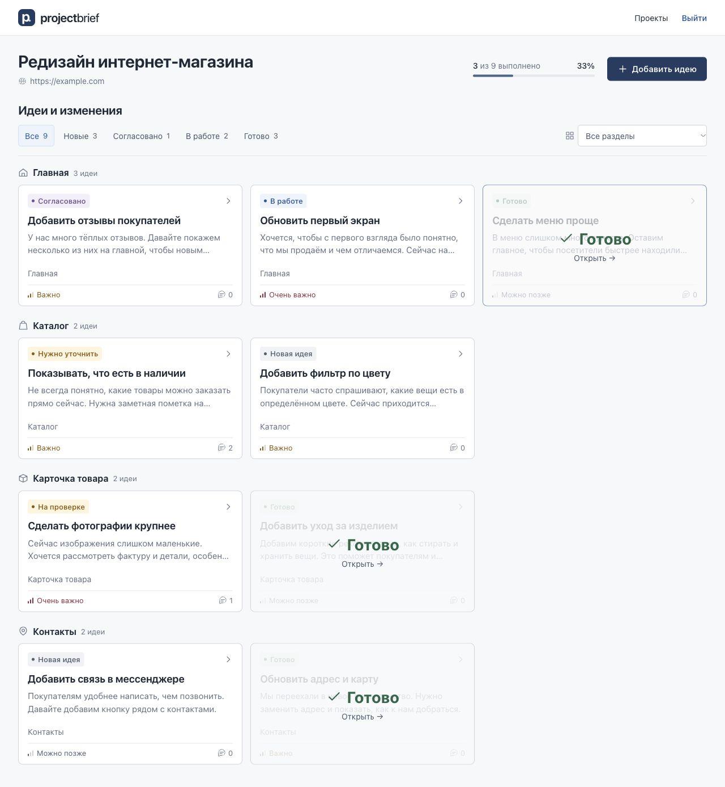
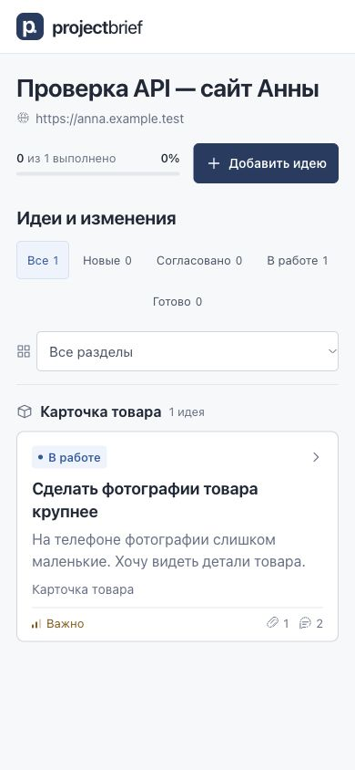

# Backend / API — проверка итерации

Дата: 5 октября 2026. Исходная версия frontend: `d67cd9102f22b58bad8a14fe57bd32548da3235a`. Существующий Vue интерфейс и developer workflow сохранены.

## Реализовано

- Laravel **13.34.0**, PHP **8.3+** (Composer platform 8.3.30), локальная проверка PHP 8.5.10, отдельная MariaDB 11.8.
- Миграции: стандартные users/sessions и cache; `projects`, `project_access_tokens`, `tasks`, `comments`, `attachments`, `task_history`. Models: User, Project, ProjectAccessToken, Task, Comment, Attachment, TaskHistory. UUID во внешних адресах; денежные поля decimal, валюта ISO.
- Admin session login/logout/me, middleware роли admin, CSRF, rate limiting; интерактивный `app:create-admin` со скрытым паролем и Laravel Hash. Публичной регистрации нет.
- Access token: 256 bits randomness, только SHA-256 hash в DB, plaintext URL выдаётся один раз и не сохраняется frontend. Вход регенерирует session, удаляет admin identity, записывает project/token IDs и redirect без секрета. Отзыв/expiry/inactive project проверяются на каждом запросе. Rotate отзывает прежние tokens атомарно.
- Отдельные `/api/admin/*` и `/api/client/*`: проекты, задачи, редактирование, согласование, comments, uploads, download/preview. Полный список — [README](../README.md#api).
- TaskAccess ограничивает все клиентские операции project_id из session. Чужие project/task/attachment UUID возвращают 404. Админские endpoints недоступны клиенту.
- Client TaskResource не содержит estimateHours, price, developerNotes, внутренние audit events. Поддельные payloads этих полей/status/project/author/history/approval отклоняются. Edit исходного ТЗ доступен только в new/clarification.
- Согласование идемпотентно, записывает timestamp и history, не меняет status. Авторы комментариев и audit history определяются backend.
- Реальные приватные файлы, MIME/extension/content/size/count проверки, очищенные исходные имена, случайные storage names, atomically saved task/files, защищённые session downloads/previews. Нет base64 в DB/public URLs.
- Vue API layer + Pinia cache, сохранённые public actions; local demo остаётся для development, production всегда API. API mode не читает/не пишет localStorage. Debounced developer autosave сериализуется, retries сохраняют drafts, focus/navigation отправляют изменения.
- Vue страницы: AdminLoginView, AdminProjectsView, AdminProjectFormView, AdminProjectView, AccessErrorView. Переключателя роли в API mode нет.

## Автоматические проверки

| Команда                                  | Результат                                                                       |
| ---------------------------------------- | ------------------------------------------------------------------------------- |
| `npm test`                               | **28 passed**, исходные 23 сохранены + 5 API/session/CSRF/multipart/error tests |
| `npm run build`                          | **PASS**                                                                        |
| `npm run format:check`                   | **PASS**                                                                        |
| `php artisan test`                       | **52 passed**, 240 assertions                                                   |
| `vendor/bin/pint --dirty --format agent` | **PASS**                                                                        |
| `php artisan migrate:fresh --seed`       | **PASS**, только новая выделенная dev MariaDB `project_brief`                   |

Laravel tests используют SQLite `:memory:` и fake filesystem. Проверяются login/wrong password/guest/role, создание/валидация проектов, UUID URLs, hash-only storage, session regeneration, invalid/revoked/expired links (включая expiry ровно сейчас), rotation/new link/revocation existing session, cross-project reads/edits/approval/comments/upload/download/preview, developer fields secrecy, crafted payloads, edit workflow, approval history/idempotency, server-derived authors, MIME/disguised/oversized uploads, total attachment limits и filename/path safety. CSRF проверяется с отключённым только тестовым bypass, дополнительно проверены Secure/HttpOnly/Lax cookies и login rate limiting. Numeric audit old/new проверены независимо от DB decimal formatting.

## Проверка в браузере на реальной MariaDB

Две изолированные cookie-сессии в in-app browser: администратор на `127.0.0.1`, клиент на `localhost`. Для этого временно менялся только локальный FRONTEND_URL; затем восстановлен стандартный `127.0.0.1:5173`. Это позволило одновременно проверить обе роли без входа/выхода между шагами.

1. Admin login, создание нового проекта с website/client/email/EUR, генерация ссылки.
2. Клиентская ссылка → project без формы входа, token убран из URL, ModeSwitcher отсутствует.
3. Клиент создаёт идею с настоящим JPG; перезагрузка сохраняет идею и файл.
4. Комментарий клиента отображается в admin session; ответ admin виден клиенту.
5. Admin меняет status, estimate=3, price=150, technical notes; после перезагрузки всё сохраняется. Client показывает только разрешённые поля и видит актуальный status. Отсутствие internal fields в API отдельно доказано Feature tests.
6. Client approve; admin видит «ТЗ согласовано клиентом», history содержит создание, файл, comments, status, internal changes и approval; client history исключает internal changes.
7. Admin открывает protected image preview: браузер успешно декодирует JPG (1280×720), доступна загрузка original.
8. После ухода со страницы admin не может повторно получить plaintext URL; видны только активность и последний вход.
9. Revoke → следующий client request теряет доступ. Старая ссылка показывает invalid, новая открывает проект.
10. Desktop 1280 px: 3 колонки (`396px 396px 396px`) в каждом разделе, done overlay и порядок сохранены. Mobile 390 px: одна колонка (`354px`), document scrollWidth=390; admin settings и developer workspace также одна колонка, без overflow.

Console admin и normal client flow: нет JavaScript errors/warnings. Преднамеренная проверка отозванной сессии вызывает ожидаемые HTTP 401. Laravel application log не содержит ошибок этого browser flow; более ранняя ошибка тестового временного fixture была исправлена, повторные тесты проходят. Tests используют null log channel, чтобы не смешивать тестовые исключения с dev application log.

Дополнительный шаг чтения существующего clipboard и очередного rotate был отклонён автоматической проверкой из-за возможных личных данных в буфере. Он не выполнялся. Copy button и fallback ручного копирования проверены по реализации; содержимое пользовательского буфера не читалось.

## Commits

| Hash      | Изменение                                        |
| --------- | ------------------------------------------------ |
| `96b6bcb` | Laravel scaffold, MariaDB и schema               |
| `29b6947` | Admin session authentication                     |
| `fb206a4` | Project management API                           |
| `3689fe7` | Secure access links                              |
| `4f7106b` | Task API и client permissions                    |
| `57b7e87` | Server-derived comments                          |
| `b6e39aa` | Private attachments / protected download         |
| `d12801f` | Vue store → Laravel API                          |
| `4cd7449` | Minimal admin UI                                 |
| `3486708` | Security cleanup, upload config, API persistence |
| `3ebe50f` | Dev fixtures и 52 backend tests                  |

Следующие test/docs commits перечислены в Git history и финальном отчёте. Все изменения публикуются в `web86/project-brief/main`, без force push.

## Следующий этап

AI, уведомления, billing, password reset/2FA, teams/roles, realtime, result acceptance и production deployment. Локальные данные не импортируются автоматически; отдельный UI редактирования/удаления идеи не добавлялся.
