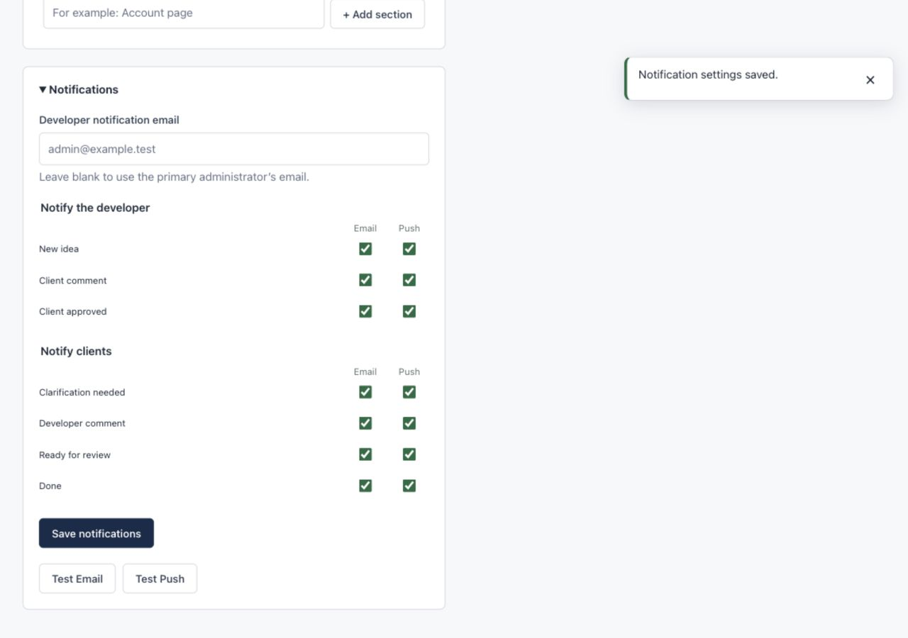
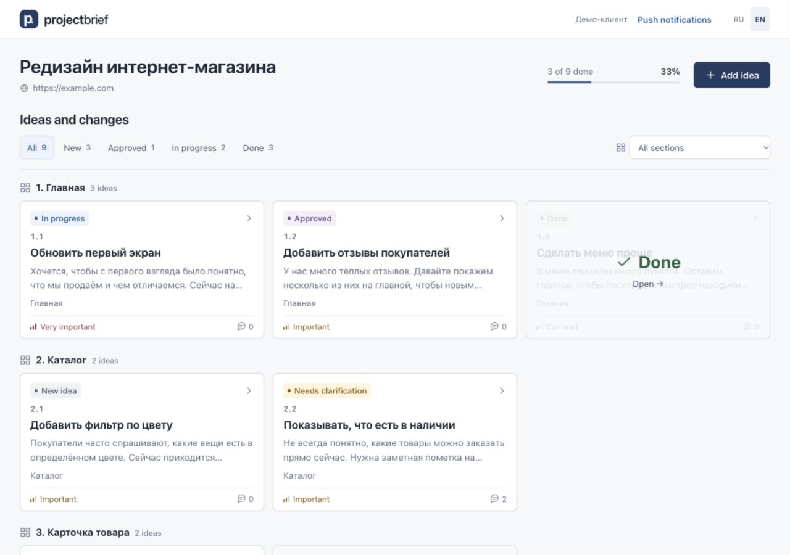
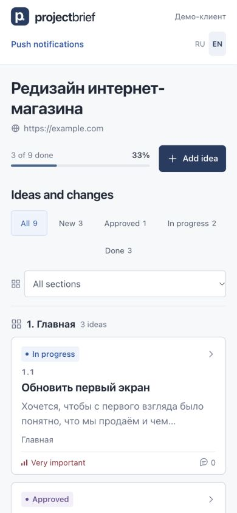

# ProjectBrief UX/PWA milestone verification

Verified locally on 8 October 2026. Initial HEAD:
`a4b235ea6cbbe01b7775af238b022bb4bbd4d3ff`. Before implementation, checkpoint
`e035a92` committed the four pre-existing files in
`artifacts/web86-sendit-2026-10-06/`; their contents were preserved. Prettier now
excludes generated artifacts so their original report does not block formatting.

## Delivered behavior

- Production examples and the configuration fallback use
  `SESSION_LIFETIME=525600`, `SESSION_EXPIRE_ON_CLOSE=false`; database sessions,
  Secure/HttpOnly/SameSite=Lax, encryption configuration and CSRF remain intact.
  The finite lifetime is 365 days of inactivity. Existing deployments must update
  their environment override and rebuild the Laravel configuration cache.
- `/app` launches through one uncached server-authoritative `/api/session` request.
  Admin sessions open `/admin`; valid client sessions open `/project/{uuid}`;
  guests see translated personal-link instructions and a secondary admin action.
  Bootstrap network failures show retry. No token/hash/credential is returned.
- The client middleware and bootstrap share the same token validator. Tests cover
  revoked/missing/expired tokens, disabled clients, inactive projects and mismatched
  session associations. Links without expiry remain reusable, including after a year.
- Authenticated personas automatically register the push-only service worker.
  Granted permission synchronizes an existing subscription or obtains a new one;
  expired owned subscriptions are renewed. Another owner's device is never silently
  unsubscribed or claimed. Explicit Enable remains available for switching.
  Default permission shows a timed Enable toast once per browsing session; the
  browser permission request starts synchronously only inside the user action.
  Denied permission never prompts. Explicit Disable persists a device preference.
  VAPID, endpoint validation, delivery events, transport and multiple devices remain unchanged.
- Global success/error/info/warning toasts provide accessible status/alert roles,
  localization, manual/timed dismissal, hover/focus pause and cleanup on unmount.
  Settings-save, Email/Push tests, Push management, project settings and client-management
  feedback use toasts; field errors, storage failure and unsaved drafts remain contextual.
- Manifest: `start_url=/app`, `id=/`, `scope=/`, `display=standalone`, green
  `#246c43` theme/background, separate 192/512 any and maskable icons plus Apple
  touch icon. SVG/PNG assets are generated locally with no extra package dependency.
  Maskable pixels remain within the safe circle; the logo occupies over 40% of
  both dimensions. All five PNGs reproduce byte-for-byte.
- The initial HTML renders the branded green loading shell before Vue, with reduced
  motion, no-JavaScript guidance, startup-error/25-second retry fallback and no
  artificial startup delay. It fades after initial routing and Vue mounting.
  The application retains its existing background and layout.

No database migrations or dependency changes were introduced. No live production
configuration, database, APP_KEY, VAPID key, SMTP service or Push provider was modified.

## Automated verification

| Command/check                                  | Result                                    |
| ---------------------------------------------- | ----------------------------------------- |
| `npm test`                                     | PASS, 76 tests, no failures/skips         |
| `npm run build`                                | PASS, production Vue bundle               |
| `npm run format:check`                         | PASS                                      |
| `php artisan test --compact`                   | PASS, 135 tests / 862 assertions          |
| `vendor/bin/pint --dirty --format agent`       | PASS                                      |
| Targeted backend session/access/security suite | PASS, 23 tests / 151 assertions           |
| PNG regeneration                               | PASS, five assets reproduce byte-for-byte |
| Production manifest/icons/splash               | PASS, copied assets match sources         |
| `git diff --check`                             | PASS                                      |

Tests include real router guards and Vue component setup/SSR, notification settings
and test-delivery feedback, toast timer behavior, Push permission gestures,
subscription ownership/expiry, persona disposal and device opt-out. Existing
notification business-event and delivery tests pass.

## Browser verification

Used an isolated temporary SQLite database, the existing local demo seeder and
localhost API/frontend servers; production and the development database were not used.

- Guest `/app` shows the neutral English screen; existing admin login works.
- With an admin session, a full `/app` navigation routes to `/admin`.
- Saving notification preferences displays a global toast at the desktop upper-right.
- A personal access link establishes a client session and removes the secret from
  the redirected URL. A subsequent full `/app` navigation opens the same client
  project directly, without an admin login/password form.
- At 390 × 844 the client screen has one column, no horizontal overflow
  (`scrollWidth=innerWidth=390`) and no bootstrap overlay after startup.
- Browser console had no warnings/errors. Temporary viewport overrides were reset.

## Remaining limits

Native Android/iOS installation and real OS/browser Push delivery were not exercised.
The permission/subscription paths are covered by deterministic browser mocks and
existing transport tests. Installability, cookie sharing across browser/installed
profiles, and Push availability depend on the platform; a lost installed-profile
session requires opening the personal access link there again. Offline project
access is not added. This task does not deploy to production or create a release ZIP.
The production `dist/` output is generated and excluded from Git as before.

## Changed milestone files

- `.prettierignore`
- `DEPLOY-JINO.md`
- `README.md`
- `api/.env.example`
- `api/.env.production.example`
- `api/README.md`
- `api/app/Http/Controllers/SessionController.php`
- `api/app/Http/Middleware/EnsureClientProjectAccess.php`
- `api/config/session.php`
- `api/routes/web.php`
- `api/tests/Feature/ProductionRoutingTest.php`
- `api/tests/Feature/SessionBootstrapTest.php`
- `bin/generate-pwa-icons.py`
- `deployment/release-files.mjs`
- `docs/pwa-client-launch.jpg`
- `docs/pwa-client-mobile.jpg`
- `docs/pwa-milestone.md`
- `docs/pwa-settings-toast.jpg`
- `index.html`
- `public/app-icon.svg`
- `public/apple-touch-icon.png`
- `public/favicon.svg`
- `public/icon-192.png`
- `public/icon-512.png`
- `public/icon-maskable-192.png`
- `public/icon-maskable-512.png`
- `public/manifest.webmanifest`
- `src/App.vue`
- `src/assets/main.css`
- `src/components/ProjectClientManager.vue`
- `src/components/ProjectFields.vue`
- `src/components/ProjectNotificationSettings.vue`
- `src/components/PushControls.vue`
- `src/components/PushDevicePanel.vue`
- `src/components/ToastViewport.vue`
- `src/locales/en.js`
- `src/locales/ru.js`
- `src/main.js`
- `src/router/index.js`
- `src/services/push.js`
- `src/services/pushEnrollment.js`
- `src/services/session.js`
- `src/services/toast.js`
- `src/views/AdminProjectView.vue`
- `src/views/AppEntryView.vue`
- `tests/notifications.test.js`
- `tests/pwa.test.js`
