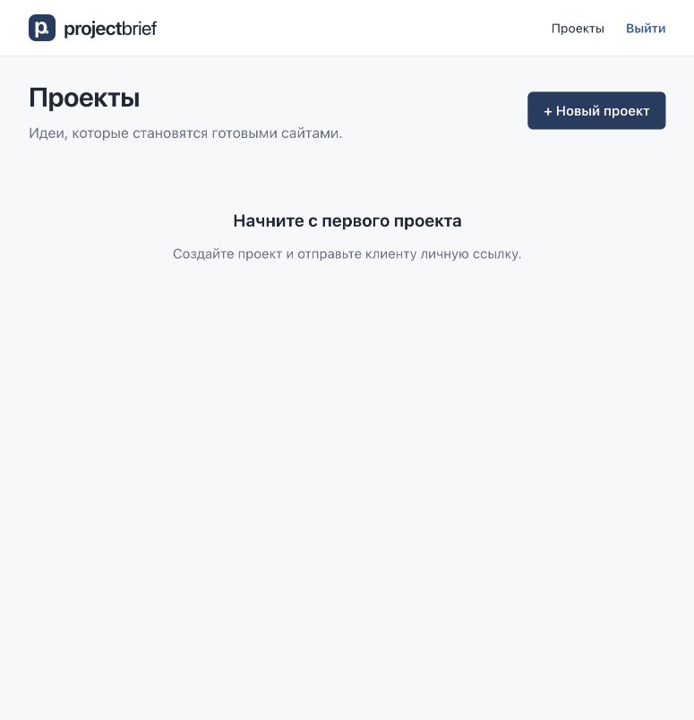

# Проверка production-пакета — 5 октября 2026

Сборка: `./bin/build-release` из чистого Git working tree. Инструкция: [DEPLOY-JINO.md](../DEPLOY-JINO.md). Архив и распакованный пакет находятся только в ignored `release/`; `release.json` содержит точный исходный commit и время сборки. Vendor не добавлен в Git. На Jino ничего не загружено.

- Frontend и release helper tests: **31/31 PASS**.
- Laravel: **64/64 PASS, 273 assertions**; отдельная SQLite `:memory:`, dev MariaDB не изменялась.
- `npm run build`: PASS; Vite 7.3.6, 75 modules; frontend source maps отсутствуют.
- Production Composer install: **77 packages**, `--no-dev`, optimized autoload; check-platform-reqs PASS. Существующий development vendor сохранён.
- Release validation: PASS, **6458 файлов** до `checksums.txt`. Нет `.env`, dev dependencies/tests, `.git`, node_modules, `.tools`, local-admin.json, local DB, `*.key`, maps, known local secrets/private key contents или symlinks. Laravel source/vendor/storage запрещены в public. Example credentials пустые.
- ZIP: проверены количество entries, целостность и SHA-256 каждого файла внутри архива. Laravel storage пустой; config/routes/events/view caches dev-среды не копируются. Runtime package discovery содержит только production providers.
- Prettier и Pint: PASS.

## Автоматический тест готового пакета

`tests/release-runtime.mjs` вызывается сборщиком до создания ZIP. Тест копирует **готовый пакет**, создаёт disposable HOME с `project-brief-app` вне `domains/brief.web86.site` и новую SQLite. В эту копию записываются только синтетические тестовые данные. Тестовая `.env`, APP_KEY, DB и admin никогда не копируются обратно в release.

Проверено: check-server; первый first-install без admin; генерация ключа; все migrations; optimize с route/config/view caches; повторный first-install с интерактивным admin creation без вывода пароля; сохранение ключа и данных при следующем запуске; пропуск уже существующего admin; health без session/DB-зависимости; `/`, `/admin`, `/admin/login`, deep admin/client routes, index.html; загрузка asset; reserved API/access/Sanctum 404; guest 401; отсутствие CSRF — 419; admin login и смена личности по валидной client link; client project scope; invalid link; maintenance 503 и восстановление 200. Тест всегда удаляет свою копию.

## PHP 8.4 и настоящий Apache

Дополнительно создан отдельный локальный Docker image на официальном `php:8.4-apache`: **PHP 8.4.26**, mod_rewrite, необходимые расширения. Document root указывал на `/srv/home/domains/brief.web86.site`, private app — `/srv/home/project-brief-app`. Node/Composer/Git в runtime не использовались. Использована копия готового пакета, затем отдельный MariaDB 11.8 container с новой тестовой **`specchina_breaf_tz`** и случайными тестовыми credentials. Ни production DB, ни существующий development MariaDB container не затрагивались.

Проверены PHP extensions/check-server, migrations MySQL, optimize, интерактивная CLI admin creation, повторная установка (`Nothing to migrate`, ключ сохранён, admin пропущен). Через настоящий Apache проверены SPA shell/direct reload, assets, health, reserved-prefix routing, включая существующий статический файл под `/api` (Laravel 404 вместо выдачи файла), запрет `.env`/`.htaccess` (403).

Через HTTP API проверены CSRF/session admin login, запись проекта и идеи в MariaDB, upload TXT в private storage, скачивание администратором и клиентом по защищённым endpoints, вход по client link и guest denial для файла. Все проверки PASS.

В браузере открыт готовый frontend через `http://127.0.0.1:8084/admin/login`, выполнен вход тестовым admin и direct reload `/admin`. Console errors/warnings: **0**; Vue chunk загрузился, admin session сохранилась. На локальном HTTP Secure cookie отключался только для тестового процесса; production env example всегда требует HTTPS/Secure/Lax/HttpOnly.

Реальные document root, Apache overrides, PHP 8.4 CLI binary, upload limits, HTTPS и production DB credentials Jino ещё предстоит проверить после предоставления console access. Путь PHP binary не предполагается. Это локальная проверка release, не deployment.
